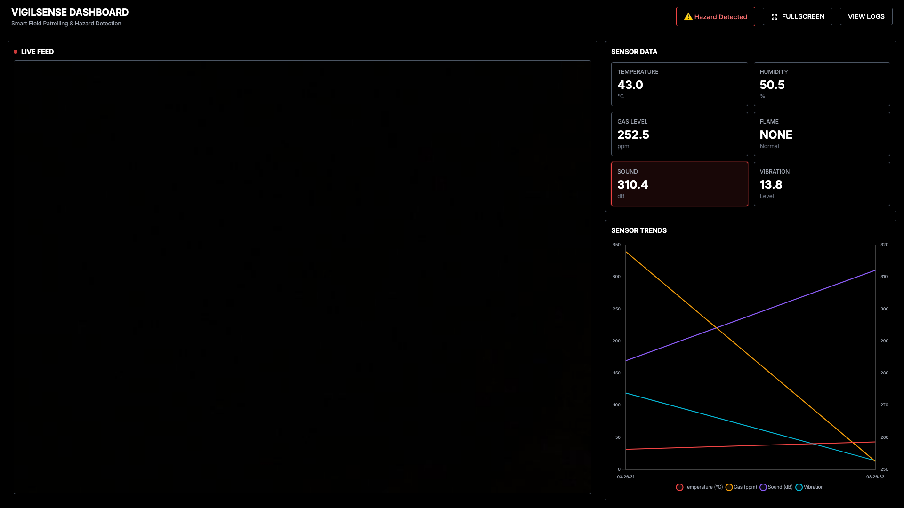
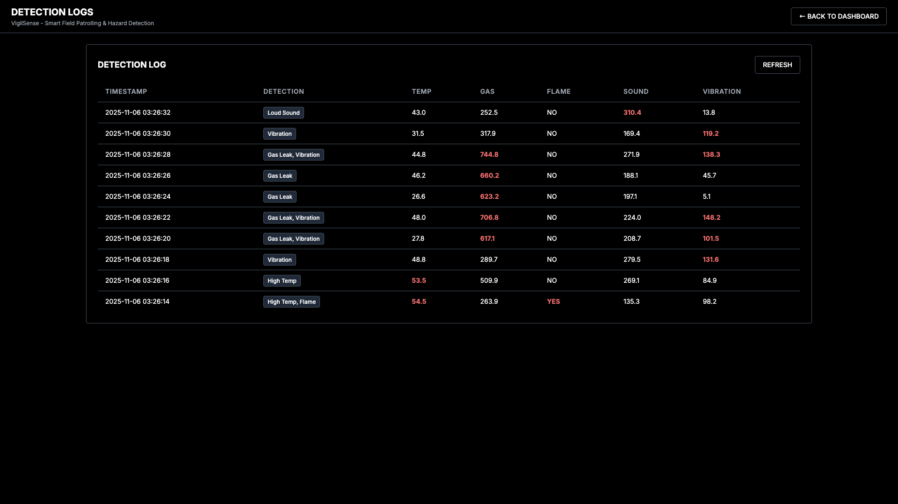
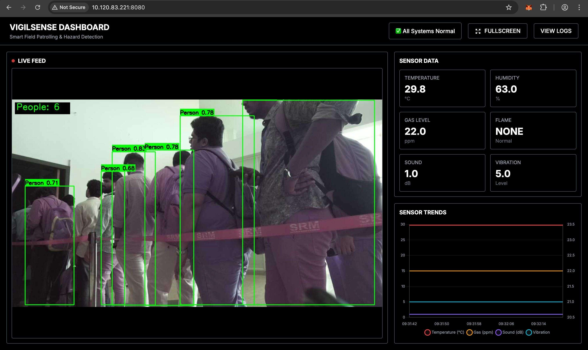

# 🚨 SerBot VigilSense

### Autonomous Field Monitoring & Hazard Intelligence Platform

[](https://www.python.org/)
[](https://flask.palletsprojects.com/)
[](https://www.arduino.cc/)
[](LICENSE)

> An autonomous IoT surveillance and hazard intelligence platform designed to reduce manual field inspections through real-time monitoring, AI-powered detection, and actionable alerts.

---

## Problem Statement

Large farms, industrial sites, and remote facilities require continuous monitoring for hazards such as fire, gas leaks, intrusions, and equipment anomalies.

Today, these inspections are often performed manually.

Manual patrols are:

* Time-consuming
* Inconsistent
* Expensive
* Reactive instead of proactive

Delayed detection of hazards can result in property loss, safety incidents, and operational downtime.

**SerBot VigilSense was built to automate routine patrol and monitoring tasks while surfacing actionable insights to operators in real time.**

---

## Product Vision

Create an autonomous monitoring platform capable of:

* Continuously patrolling an environment
* Detecting hazards in real time
* Alerting operators only when intervention is required
* Reducing cognitive overload caused by raw sensor streams
* Providing a single operational dashboard for situational awareness

---

## Users

### Field Supervisor

Needs visibility into environmental hazards without physically inspecting every location.

### Security Personnel

Needs immediate alerts for intrusions and abnormal activity.

### Operations Manager

Needs historical trends, incident logs, and operational intelligence.

---

## Key Capabilities

### 🎥 AI-Powered Situational Awareness

* Real-time video streaming from Raspberry Pi Camera v3
* YOLOv8-based person detection
* Live occupancy count
* Bounding-box overlays for detected persons

### 📊 Hazard Intelligence Dashboard

Real-time monitoring of:

* Temperature
* Humidity
* Gas concentration
* Flame detection
* Sound activity
* Vibration anomalies

The dashboard transforms raw telemetry into operator-friendly alerts.

### 🚨 Actionable Alerting

Threshold-based hazard detection generates color-coded alerts for:

* Fire risk
* Gas leakage
* Excessive vibration
* Environmental anomalies

Operators can immediately identify critical events without inspecting raw sensor values.

### 🤖 Autonomous Mobility & Remote Operations

* Browser-based robot control
* Bluetooth Low Energy control
* Four-motor navigation system
* Real-time status feedback

### 📈 Operational Intelligence

* Historical detection logs
* Sensor trend visualization
* Event timelines
* Incident history for post-event analysis

---

## Why These Design Decisions?

### Why Edge AI?

Agricultural and remote environments often suffer from unreliable internet connectivity.

Running inference directly on the Raspberry Pi ensures:

* Lower latency
* Reduced network dependence
* Higher reliability
* Real-time response

### Why YOLOv8?

YOLOv8 provides a strong balance between:

* Detection accuracy
* Inference speed
* Resource efficiency

making it suitable for edge deployment.

### Why Raspberry Pi + Arduino?

The architecture separates compute-intensive and hardware-intensive tasks.

**Raspberry Pi**

* Computer vision
* Dashboard hosting
* Video streaming

**Arduino UNO R4 WiFi**

* Sensor acquisition
* Motor control
* Low-level hardware management

This modular architecture improves maintainability and scalability.

---

## 📸 Screenshots


*Main dashboard with live camera feed, sensor cards, and trend graphs*


*Detailed detection log table with timestamp and sensor readings*


*Live showcase of the dashboard feed at the Serbot Tech Expo*

---

## System Architecture

```text
┌────────────────────┐
│     Operators      │
│ Browser / Mobile   │
└─────────┬──────────┘
          │
          ▼
┌────────────────────────────┐
│ VigilSense Dashboard       │
│                            │
│ • Live Video Feed          │
│ • Hazard Alerts            │
│ • Sensor Analytics         │
│ • Incident Logs            │
└─────────┬──────────────────┘
          │
          ▼
┌────────────────────────────┐
│ Raspberry Pi              │
│                            │
│ • Flask Server            │
│ • YOLOv8 Inference        │
│ • Camera Processing       │
└─────────┬──────────────────┘
          │ Serial
          ▼
┌────────────────────────────┐
│ Arduino UNO R4 WiFi       │
│                            │
│ • Sensor Collection       │
│ • Motor Control           │
│ • BLE/WiFi Interface      │
└─────────┬──────────────────┘
          │
          ▼
┌────────────────────────────┐
│ Sensors & Actuators       │
│                            │
│ • Gas Sensor              │
│ • Flame Sensor            │
│ • DHT11                   │
│ • Microphone              │
│ • Vibration Sensor        │
│ • DC Motors               │
└────────────────────────────┘
```

---

## Success Metrics

The platform was designed to optimize:

| Metric                   | Goal                                        |
| ------------------------ | ------------------------------------------- |
| Hazard Detection Latency | < 2 seconds                                 |
| Alert Accuracy           | High precision with minimal false positives |
| Sensor Availability      | Continuous monitoring                       |
| Operator Response Time   | Reduced through actionable alerts           |
| Monitoring Coverage      | Continuous autonomous observation           |

---

## Technology Stack

### Backend

* Flask
* OpenCV
* Ultralytics YOLOv8
* PySerial
* Gevent

### Frontend

* TailwindCSS
* Chart.js
* Vanilla JavaScript

### Hardware

* Raspberry Pi 4
* Arduino UNO R4 WiFi
* Pi Camera v3
* L293D Motor Driver

---

## Roadmap

### Version 2.1

* Predictive hazard forecasting
* Alert severity scoring
* Automatic incident reports

### Version 2.2

* Multi-robot coordination
* Fleet monitoring dashboard
* Mission scheduling

### Version 3.0

* Autonomous waypoint navigation
* Fleet orchestration
* Cloud analytics platform

---

## Repository Structure

```
vigil_sense_dashboard/
├── app.py                          # Flask backend with YOLO
├── requirements.txt                 # Python dependencies
├── templates/
│   ├── index.html                  # Main dashboard
│   └── logs.html                   # Detection logs page
├── static/
│   ├── css/
│   │   └── style.css              # Custom styles
│   └── js/
│       └── dashboard.js           # Frontend logic
├── arduino_code.ino                # Sensor data collection
├── arduino_motor_control_ble.ino  # Bluetooth motor control
├── arduino_motor_control.ino      # WiFi motor control
├── deploy_to_pi.sh                 # Deployment script
├── upload_motor_control*.sh       # Motor control upload scripts
└── docs/
    ├── HARDWARE_SETUP.md
    ├── ARDUINO_SETUP.md
    ├── MOTOR_CONTROL_SETUP.md
    └── ...
```

## Author

### Janmay

GitHub: https://github.com/kriegher12

Project Repository:
https://github.com/kriegher12/serbot--vigil-sense
